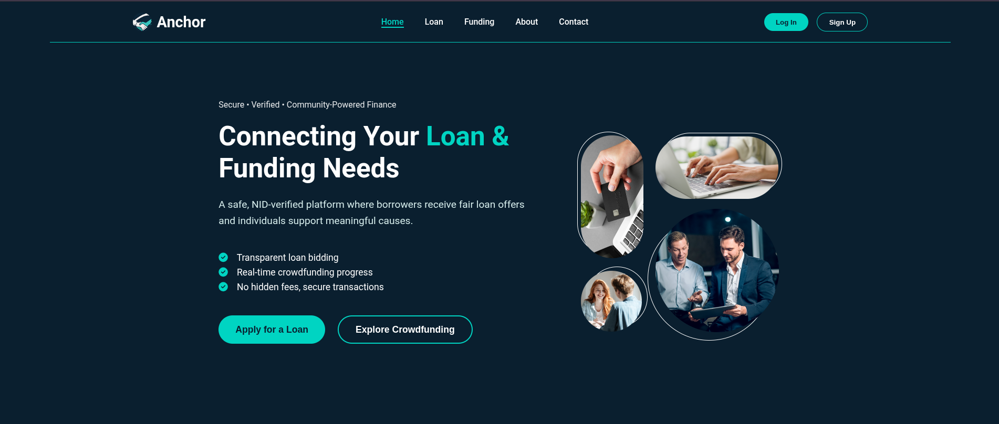

Anchor — Student-Powered Loan & Crowdfunding Platform
=====================================================

Anchor is a university-focused financial support platform designed specifically for students. It combines crowdfunding, peer-to-peer lending, ratings, and document-based verification to create a transparent and secure environment for financial assistance. Students can request loans, seek emergency funding, donate to peers, and track borrower behavior—supported by verification, ratings, and admin oversight.

Project Description
===================

Anchor aims to build a safe, transparent, and fraud-resistant financial ecosystem for university students. The platform enables:

*   Simple and verified loan requests
    
*   Community-driven crowdfunding
    
*   Transparent borrower history
    
*   Document-backed trust and identity verification
    
*   Accountability through ratings
    
*   Administrative moderation and approval
    

This ensures that students receive help confidently, lenders make informed decisions, and the community stays safe from fraud.

Tech Stack
==========

Frontend (This Repository)
--------------------------

*   **HTML5**
    
*   **CSS3**
    
*   **JavaScript (ES6+)**
    
*   **Fetch API** for backend communication
    
*   **No frameworks**, lightweight and optimized for speed
    
*   Hosted on **GitHub Pages** or **Netlify**
    

Backend (Separate Server)
-------------------------

*   **PHP (REST API)**
    
*   **MySQL Database**
    
*   **Prepared Statements / PDO** for security
    
*   **JWT / Session-based authentication** (depending on your implementation)
    
*   **API endpoints** consumed by the frontend
    

Frontend Folder Structure
=========================

Plain textANTLR4BashCC#CSSCoffeeScriptCMakeDartDjangoDockerEJSErlangGitGoGraphQLGroovyHTMLJavaJavaScriptJSONJSXKotlinLaTeXLessLuaMakefileMarkdownMATLABMarkupObjective-CPerlPHPPowerShell.propertiesProtocol BuffersPythonRRubySass (Sass)Sass (Scss)SchemeSQLShellSwiftSVGTSXTypeScriptWebAssemblyYAMLXML`   ANCHOR-FRONTEND/  ├── images/  │  ├── includes/  │   ├── footer.html  │   ├── header.html  │   └── header-loggedin.html  │  ├── javascript/  │   ├── admin-shortcut.js  │   ├── funding.js  │   ├── header-footer.js  │   ├── index.js  │   └── loan.js  │  ├── styles/  │   ├── auth.css  │   ├── contact.css  │   ├── funding.css  │   ├── header-footer.css  │   ├── index.css  │   └── loan.css  │  ├── admin-dashboard.html  ├── admin-login.html  ├── contact.html  ├── funding.html  ├── index.html  ├── loan.html  ├── login.html  ├── signup.html  ├── README.md   `

Platform Features and Student Benefits
======================================

1\. Student-Driven Crowdfunding
-------------------------------

Students can create posts for emergencies, medical help, relief efforts, or personal causes.**Benefits:**

*   Immediate support during emergencies
    
*   Full transparency builds community trust
    
*   Easy navigation and category-based discovery
    

2\. Peer-to-Peer Loan Requests
------------------------------

Students submit structured, clear loan requests with proof documents.**Benefits:**

*   Safer alternative to high-interest or informal loans
    
*   Clear repayment plans reduce financial stress
    
*   Student-friendly, minimal forms
    

3\. Document-Verified Transparency
----------------------------------

Every request requires proof documents (ID, bills, reason, etc.).**Benefits:**

*   Reduces fraud and fake requests
    
*   Builds trust among donors and lenders
    
*   Ensures authenticity across the platform
    

4\. Borrower Profiles & Loan History
------------------------------------

Each borrower has a transparent record of past loans and repayments.**Benefits:**

*   Lenders make informed decisions
    
*   Reputable borrowers get faster approval
    
*   Encourages financial responsibility
    

5\. Rating & Review System
--------------------------

Lenders rate borrowers after repayment.**Benefits:**

*   Promotes trustworthy behavior
    
*   Helps identify reliable borrowers
    
*   Creates a self-governing community
    

6\. Lender/Donor Dashboard
--------------------------

Students can view all loan requests, documents, and borrower history.**Benefits:**

*   Clear comparison of requests
    
*   All data in one organized dashboard
    
*   Reduces time and confusion
    

7\. Crowdfunding Feed with Search & Filters
-------------------------------------------

A card-based feed displaying all posts with category and sort options.**Benefits:**

*   Fast discovery of urgent cases
    
*   Clean, student-friendly UI
    
*   More engagement and participation
    

8\. Admin Verification Panel
----------------------------

Admins approve posts, validate identities, and monitor activity.**Benefits:**

*   Ensures the platform stays safe and authentic
    
*   Removes fake or suspicious posts
    
*   Maintains fairness across the system
    

Why Students Should Choose Anchor
=================================

### 1\. Built Exclusively for Students

Every feature is tailored for the needs, challenges, and skill levels of university students.

### 2\. Transparent and Trustworthy

Verified posts, documented proof, and borrower history ensure a safe financing environment.

### 3\. Community-Based Support

Students help students—making the platform more personal, empathetic, and effective.

### 4\. Financially Safe and Fair

No predatory interest, no hidden fees, no risky borrowing.Just transparent peer-to-peer help.

### 5\. Document-Backed Security

Every request requires:

*   Student ID
    
*   Documents
    
*   Admin approval
    
*   Honest declarations
    

This prevents fraud and builds real trust.

### 6\. Simple, Clean, and Minimal UI

Designed for ease of use:

*   Clean forms
    
*   Organized dashboards
    
*   Mobile-friendly layouts
    
*   Easy navigation
    

### 7\. Encourages Good Behavior

Borrowers with good ratings get better support.This system teaches responsibility and accountability.

Final Summary
=============

Anchor is a student-centered financial platform that brings together crowdfunding, peer-to-peer lending, community ratings, and admin verification. The system is built on trust, transparency, and simplicity—empowering students to access help, support others, and grow financially responsible in a secure community.